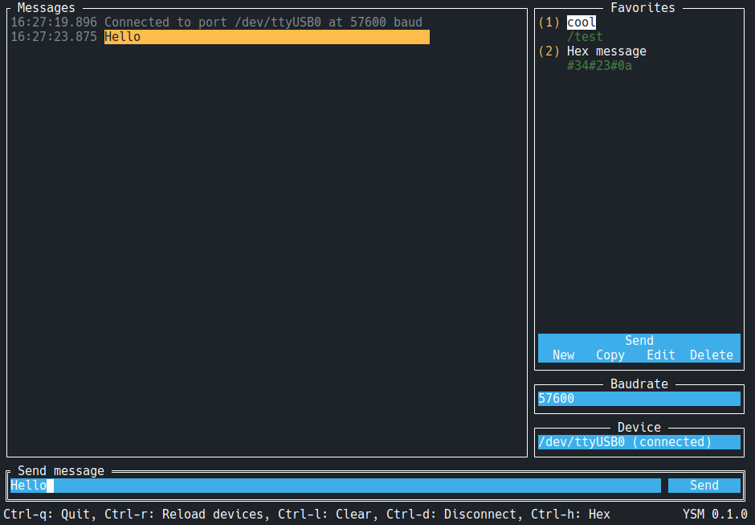

# Yesbotics Serial Monitor - ysm

A fast and lightweight serial monitor with some helping functions to work with the
Yesbotics [Simple Serial Protocol](https://github.com/yesbotics/simple-serial-protocol-docs)
             


## Install

### Go

If you have `go` installed (Go version >= **1.16**) you can use `go install`

```
go install github.com/yesbotics/yesbotics-serial-monitor
```

## Usage

Simply call `ysm` in your terminal:

```
ysm
```

For start parameter help

```
ysm -h
```
